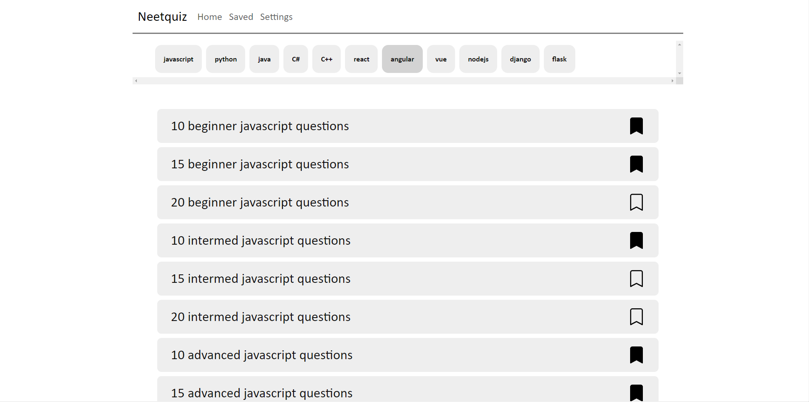

# neet quiz

Welcome to Neet Quiz, your go-to place for honing your computer science skills! 🖥️🚀

Visit here -> [neet-quiz](https://neet-quiz.vercel.app)

🧠 Sharpen Your Knowledge: Neet Quiz provides a diverse collection of quiz questions covering a wide range of computer science topics. Whether you're an aspiring programmer, a tech enthusiast, or a student preparing for exams, you'll find quizzes to challenge and expand your knowledge.

📚 Learn at Your Own Pace: Test your abilities with our interactive quizzes, carefully designed to help you learn and retain key concepts. Explore topics like coding languages, algorithms, data structures, and more!

💾 Save Your Progress: We understand the importance of tracking your progress. Neet Quiz allows you to save your quizzes and monitor your growth over time. See how you improve and celebrate your achievements.

🌐 Anytime, Anywhere: Neet Quiz is available on all your devices, so you can practice and learn on the go. Take advantage of spare moments to enhance your computer science skills.

## Bugs

- currently there are no bugs 😁

## Technologies

- HTML | CSS
- JavaScript | ReactJS
- bootstrap
- Vercel
